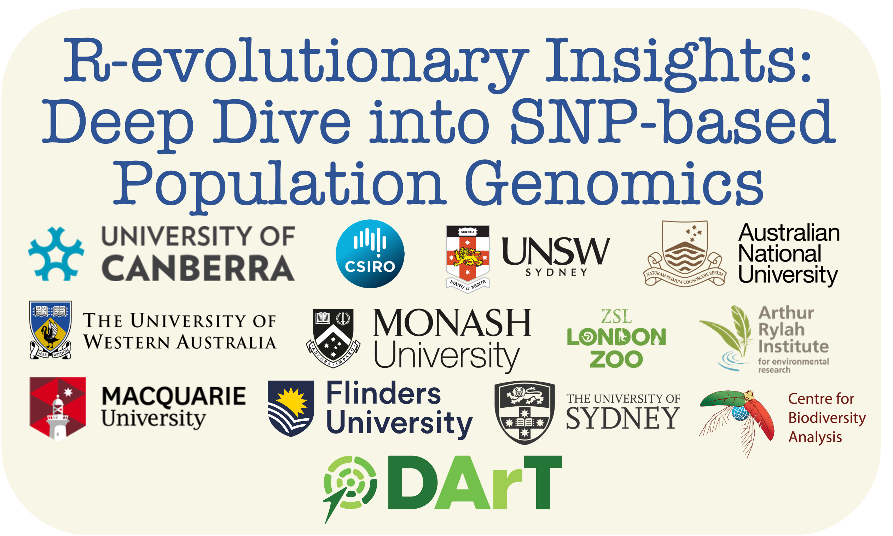
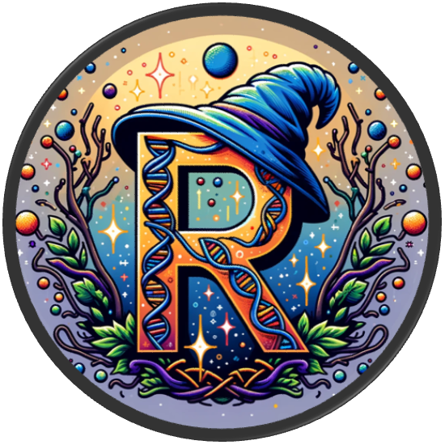

  
  <!-- README.md is generated from README.Rmd. Please edit that file -->
  
  ```{r, include = FALSE}
knitr::opts_chunk$set(
  collapse = TRUE,
  comment = "#>",
  fig.path = "pictures",
  out.width = "100%"
)
```

# `Population Genomics in R workshop` <a href="https://green-striped-gecko.github.io/dartR/"></a>

Welcome, Fellow Magical Beings, to our 5-day spellbinding journey in the 
mystical realm of Population Genetics using the ancient art of R! We’re over 
the moon (and not just because we’ve mastered levitation spells) to have you 
join us at the enchanted Kioloa ANU Coastal Campus. Nestled among the 
spellbound forests of Murramarang Nation Park and the crystal-clear waters of
southern New South Wales, our meeting lair couldn’t be more perfect. When 
you’re not weaving R spells, you’ll find yourself spoiled for choice with 
magical brews (a.k.a. coffee) and breathtaking sceneries.

Our coven is as varied as the potions in a wizard’s pantry, bringing together 
sorcerers from all corners of the realm. Here, every sorcerer and sorceress
will don both the student’s cloak and the teacher’s hat, expanding their arcane 
knowledge in genetics for the noble causes of biodiversity conservation and
ecosystem restoration. Expect a cauldron bubbling with interaction, where being
right is as celebrated as making mistakes, where sensitivity meets resilience, 
and where every voice conjures new spells of knowledge, perspective, and 
innovation.

Our quest is to master key incantations in population genetics, with our wands 
pointed firmly at the R statistical grimoire. We’re ditching the dusty tomes 
for hands-on magic, aiming to empower you to conjure your own population
genetics enchantments by the end of our gathering. And fear not, there will be
ample time to apply these spells on your own datasets.

Our magic words? Cooperation, flexibility, and dedication. We embark on this 
journey with a spirit of camaraderie, ready to share potions, carry scrolls, 
and lend a helping wand in times of need. The path may twist and turn, with 
unexpected dragons (breakdowns), storms (rain), and spells gone awry (tech
hiccups), but our collective humour and knack for improvisation will see us 
through.

We are united by a deep-seated dedication to unravelling the mysteries of
genetics, a passion that burns as bright within you as it does within us. We 
believe this adventure will be rewarding not just intellectually, but also 
aesthetically, socially, and culturally. We can’t wait to embark on this 
enchanting journey with you. May our time together be as fulfilling as finding
the philosopher’s stone! 

</a>


