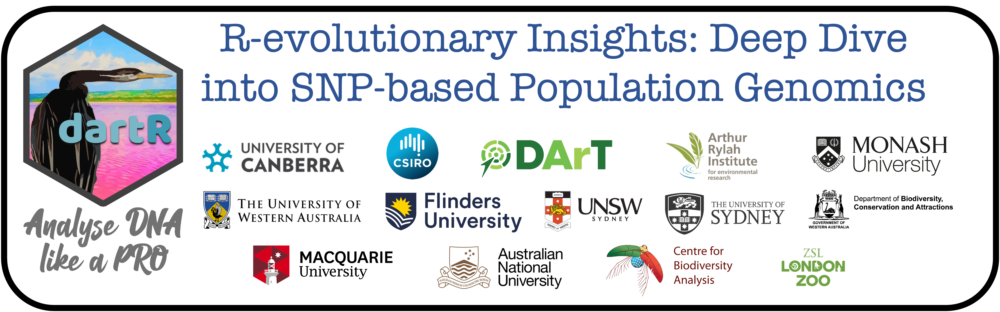

# `Population Genomics in R workshop` 

DNA is the original big data. It encodes all kinds of information that
is useful for medicine, agriculture, and environmental management. Our
challenge is to collect this information and make sense of it. The first
part of this challenge is now within reach, with new technologies
providing access to vast DNA sequence resources. But capitalising on
this rich and much-needed source of information usually requires deep
theoretical understanding, considerable computer resources, and strong
programming skills. Thus, researchers and stakeholders often struggle to
keep up with the various ways to analyse and apply genetic data and to
take maximum advantage of them to inform conservation and restoration as
the number of analyses and their complexity increases, accessible,
streamlined and reliable platforms to analyse genetic data will play a
crucial role in translating science into practice.

This 5-day training workshop run by developers of popular R packages and
experienced practitioners will help students and ECRs get the most out
their population genomics research using R. The first 2 days will focus
on bringing everyone up to speed with an introduction to R, R packages,
population genetics principles, and their application in a conservation
context. The following three days will include more advanced topics.
Each day will have three blocks of two hours. Each block would consist
of 30 minutes of theory, 60 minutes of analysis in R and 30 minutes
about how to apply theory and analysis results in the real world.

Workshop fees: \$850 AUD in-person (30 people); \$425 AUD online (30
people). The in-person fee includes accommodation, meals, and
transportation. Transportation will be available Sydney-Kioloa-Sydney
and Canberra-Kioloa-Canberra.

Recordings of all the workshop sessions and workshop materials will be
freely available online.
